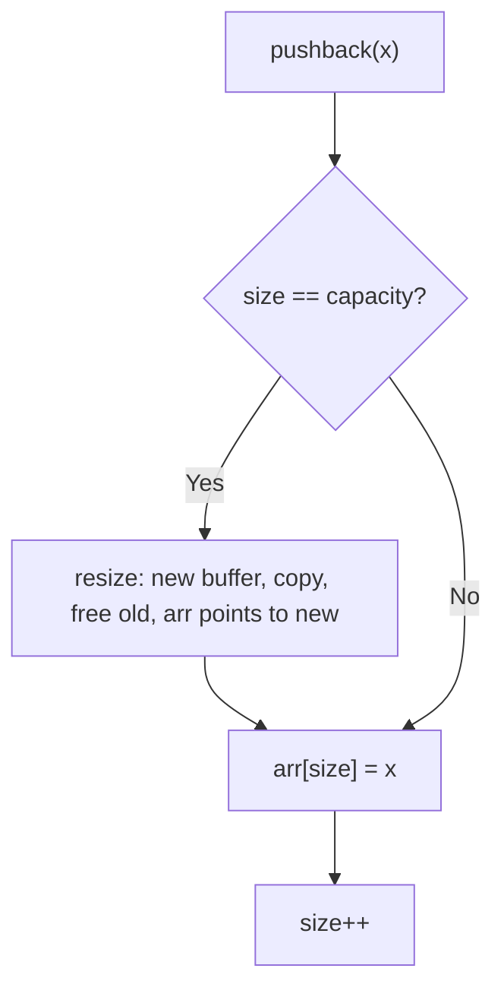

# Dynamic array

## Summary

A **dynamic array** is a **contiguous** block of memory that stores elements in order, like a fixed array, but can **grow** when more elements are added than the current allocation allows. Implementations track two sizes:

| Term | Meaning |
|------|---------|
| **Size** (or **length**) | Number of elements currently in use |
| **Capacity** | Number of slots allocated in the backing buffer |

Unused slots from `size` to `capacity - 1` are reserved for future appends without reallocating every time.

**Fixed array:** size is fixed at creation. **Dynamic array:** when `size == capacity`, allocate a larger buffer (often **double** the capacity), copy existing elements, free the old buffer, then append.

This is the same core idea as C++ [`std::vector`](https://en.cppreference.com/w/cpp/container/vector) and similar structures in other languages.

## Further viewing

- [Dynamic array explainer (YouTube Short)](https://www.youtube.com/shorts/Kj1oJhbRmbM)

## Core operations

| Operation | Behavior | Time | Extra space |
|-----------|----------|------|-------------|
| Index read (`get`) | Return element at `i` | O(1) | O(1) |
| Index write (`set`) | Write element at `i` | O(1) | O(1) |
| Append (`pushback`) | Add at end; grow if full | **Amortized** O(1) | O(1) until resize |
| Pop from end (`popback`) | Remove last element; return it | O(1) | O(1) (this impl does not shrink capacity) |
| Resize (internal) | New buffer + copy | O(n) when it runs | New buffer of size Θ(n) |

### Why `pushback` is amortized O(1)

When capacity grows by a **constant factor** (e.g. new capacity = `2 × old`), resizing costs O(n) but happens only after Ω(n) cheap appends since the last resize. Over a long sequence of appends, the total copy work is proportional to n (geometric series), so **average** cost per append is O(1). Worst single append is still O(n) when a resize happens.

## Resize / growth algorithm

Typical steps when the buffer is full:

1. Choose `newCapacity` (e.g. `2 * capacity`, or `1` if `capacity == 0`).
2. Allocate a new array of length `newCapacity`.
3. Copy the current `size` elements into the new array.
4. `delete[]` (or free) the old array.
5. Point the implementation’s pointer at the new array and set `capacity = newCapacity`.
6. Append the new element and increment `size`.

## Reference implementation in this repo

The study implementation lives at [`cpp/src/arrays/dynamic-array.cpp`](../../../cpp/src/arrays/dynamic-array.cpp).

It keeps:

- `int *arr` — heap-allocated buffer  
- `length` — number of elements in use  
- `capacity` — allocated length  

`pushback` calls `resize()` when `length == capacity`. `resize()` grows capacity (handling `capacity == 0` by going to `1`), copies `length` elements, frees the old buffer, and **reassigns** `arr` to the new block.

**Contract:** `popback()` requires `length > 0` (enforced with `assert` in the reference file). Out-of-range `get` / `set` are undefined if you pass invalid indices.

## C++ and production practice

- **`std::vector<T>`** is the standard dynamic array: it manages allocation, growth, destructor, move/copy semantics, and exception safety.
- **Raw `new[]` / `delete[]`** require a **destructor** to avoid leaks, and correct **copy constructor** and **copy assignment** (or deletion thereof) to avoid double-free — the “Rule of Three / Five.” The small class in this repo is for learning; prefer `std::vector` in real code.
- **Undefined behavior:** unchecked `get(i)` / `set(i, v)` with `i < 0` or `i >= length` is invalid.

## Pitfalls and edge cases

- **Pop when empty:** Must not return a “last element”; define behavior (error, assert, optional) and stick to it.
- **Zero initial capacity:** Multiplying `0` by two stays `0`; growth logic must bump capacity to at least `1` when reallocating.
- **Very large capacities:** Naïve `capacity * 2` can overflow; production containers check for overflow before allocating.
- **Iterator / index invalidation:** After a resize, any raw pointer into the old buffer is invalid; `std::vector` iterators have the same rule after reallocation.
