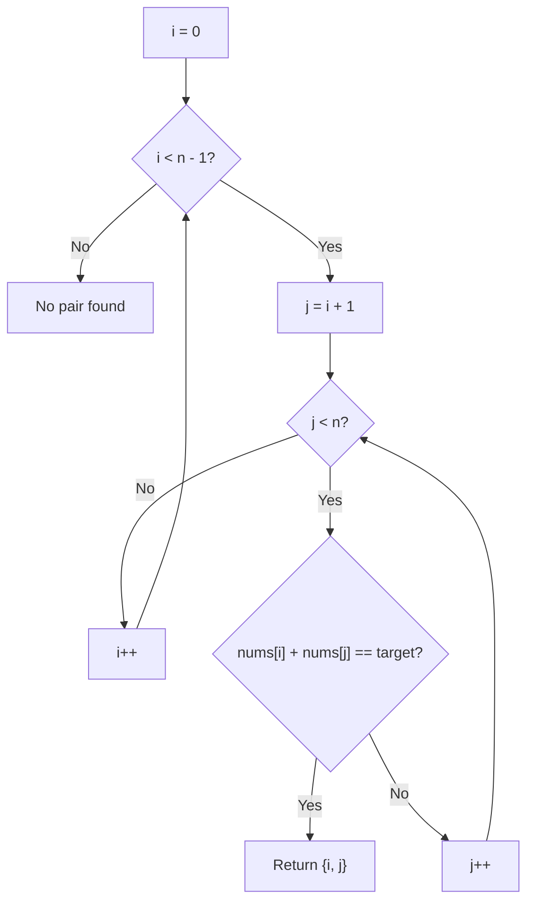
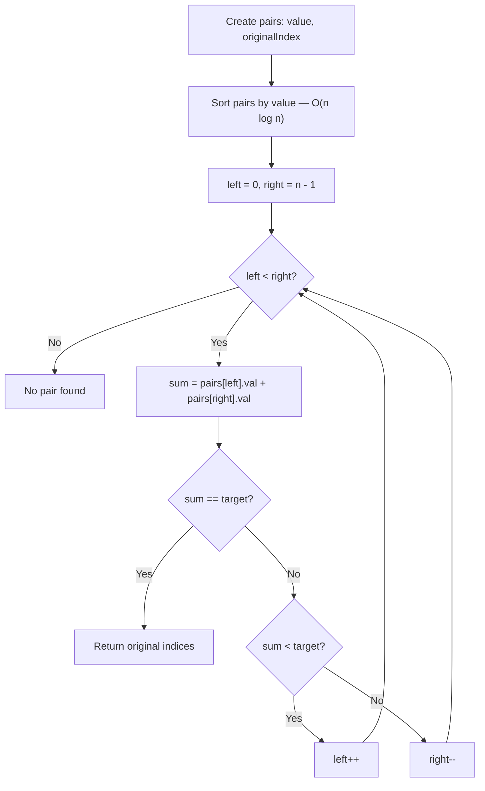
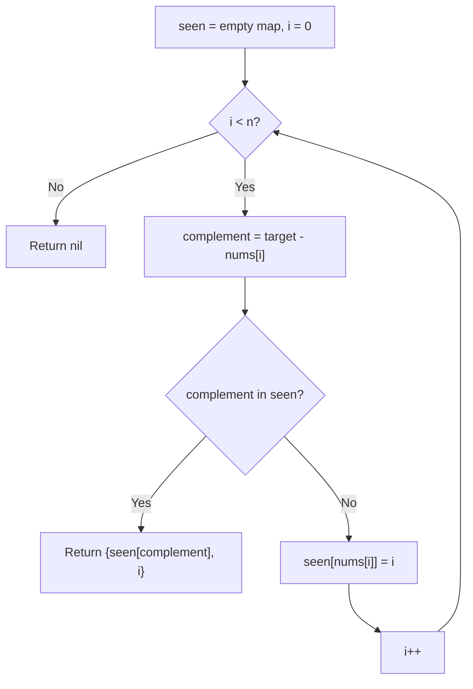

# Two Sum

## Problem Statement
Given an array of integers `nums` and an integer `target`, return the indices of the two numbers such that they add up to `target`. Each input has exactly one solution, and you may not use the same element twice.

## Pattern / Topic
Arrays, Hashing

## Approaches

### 1. Brute Force

**Idea:** Try every pair of elements and check if they sum to the target.

**Step-by-step:**
1. Use an outer loop `i` from `0` to `n-2`.
2. Use an inner loop `j` from `i+1` to `n-1`.
3. If `nums[i] + nums[j] == target`, return `{i, j}`.

**Why it works:** By exhaustively checking all pairs where `i < j`, we guarantee that if a valid pair exists it will be found. The constraint "exactly one solution" means we can return on the first match.

**Time Complexity Breakdown:**
- Outer loop runs `n - 1` iterations.
- For each outer iteration, the inner loop runs up to `n - 1 - i` iterations.
- Total comparisons: `(n-1) + (n-2) + ... + 1 = n(n-1)/2`.
- Combined: **O(n^2)** — the nested loop dominates; no other operations exceed constant time per iteration.

**Space Complexity Breakdown:**
- No auxiliary data structures; only loop indices and a constant number of variables.
- Total extra space: **O(1)**.

**Pros:** No extra memory; trivial to implement and verify correctness.
**Cons:** Quadratic time makes it impractical for large inputs (e.g. n = 10^5 yields ~5 * 10^9 comparisons).

---

### 2. Sorting + Two Pointers

**Idea:** Sort an index-annotated copy of the array, then use two pointers converging from both ends to find the pair.

**Step-by-step:**
1. Create a copy of `nums` annotated with original indices: `pairs[i] = (nums[i], i)`.
2. Sort `pairs` by value.
3. Set `left = 0`, `right = n - 1`.
4. While `left < right`:
   - Compute `sum = pairs[left].value + pairs[right].value`.
   - If `sum == target`, return `{pairs[left].index, pairs[right].index}`.
   - If `sum < target`, increment `left`.
   - If `sum > target`, decrement `right`.

**Why it works:** After sorting, moving `left` right increases the sum and moving `right` left decreases it. This monotonic property guarantees we explore all necessary combinations without missing the answer.

**Time Complexity Breakdown:**
- Creating the annotated copy: O(n).
- Sorting the copy (comparison-based sort): O(n log n).
- Two-pointer scan: each pointer moves at most n times total, so O(n).
- Combined: O(n) + O(n log n) + O(n) = **O(n log n)** — sorting dominates because n log n grows faster than n for large n.

**Space Complexity Breakdown:**
- Annotated copy of the array: O(n) (stores n pairs of value + original index).
- Sort may use O(log n) stack space internally.
- Total extra space: **O(n)** — the copy dominates.

**Pros:** Faster than brute force for large n; uses the well-known two-pointer pattern; no hash table overhead.
**Cons:** Requires O(n) extra space for the annotated copy; extra bookkeeping to recover original indices; still not linear.

---

### 3. Optimal — Hash Map (Single Pass)

**Idea:** Iterate once, storing each number's index in a hash map. For each element, check if its complement (`target - nums[i]`) is already in the map.

**Step-by-step:**
1. Initialize an empty hash map `seen` (key: number, value: index).
2. For each index `i` from `0` to `n-1`:
   a. Compute `complement = target - nums[i]`.
   b. If `complement` exists in `seen`, return `{seen[complement], i}`.
   c. Otherwise, insert `nums[i] -> i` into `seen`.

**Why it works:** When we reach index `i`, the map contains all elements before `i`. If the complement is present, we have found two distinct indices that sum to the target. Inserting *after* the lookup prevents using the same element twice.

**Time Complexity Breakdown:**
- Single loop over n elements: O(n) iterations.
- Each iteration does one hash map lookup and at most one insert: O(1) average each.
- Combined: n * O(1) = **O(n)** average. Worst-case hash collisions could degrade a single lookup to O(n), making the theoretical worst case O(n^2), but this is rare with a good hash function.

**Space Complexity Breakdown:**
- Hash map stores at most n key-value pairs: O(n).
- No other auxiliary structures beyond a few variables.
- Total extra space: **O(n)**.

**Pros:** Linear average time; clean single-pass logic; no sorting needed.
**Cons:** Uses O(n) extra space; worst-case hash collisions (rare) can degrade performance.

---

## Approach Comparison

| Approach | Time | Space | Pros | Cons |
|----------|------|-------|------|------|
| Brute Force | O(n^2) | O(1) | No extra memory | Too slow for large n |
| Sorting + Two Pointers | O(n log n) | O(n) | Faster than brute force; no hashing | Index bookkeeping; still not linear |
| Hash Map (Optimal) | O(n) avg | O(n) | Single pass, linear time | Extra space; rare worst-case collisions |

## Key Pitfalls
- Don't use the same element twice — check the map *before* inserting the current element.
- The problem guarantees exactly one solution, so no need to handle zero or multiple matches.
- Return indices, not the values themselves.

## Interview Talking Points
- Start by mentioning the brute force O(n^2) approach, then optimize with a hash map.
- Mention that this is a classic "complement lookup" pattern — useful in many array problems.
- If asked about sorted input, mention the two-pointer O(n) / O(1) variant.

## Solutions
- C++: `cpp/src/arrays/two-sum.cpp`
- Go: `go/problems/arrays/two-sum.go`
- Visualizer metadata: `content/problems/arrays/two-sum.json`
