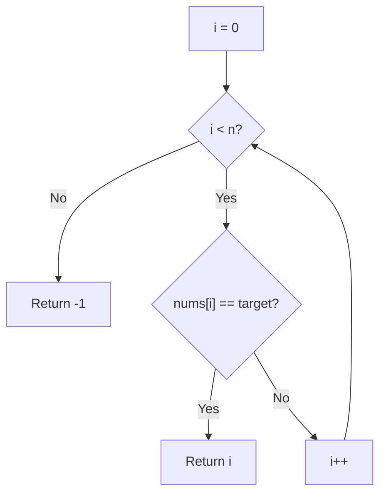
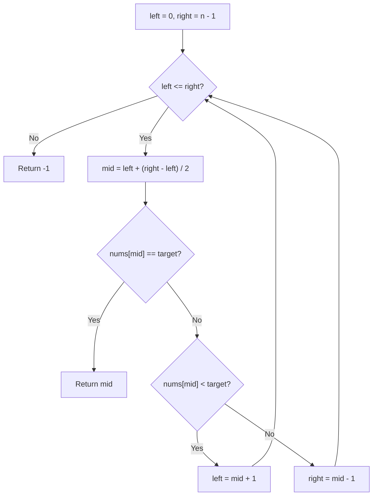

# Binary Search

## Problem Statement
Given a sorted array of integers and a target value, return the index of the target if found, or -1 if not present.

## Pattern / Topic
Searching, Divide and Conquer

## Approaches

### 1. Brute Force — Linear Scan

**Idea:** Walk through every element and compare it to the target.

**Step-by-step:**
1. For each index `i` from `0` to `n-1`:
   a. If `nums[i] == target`, return `i`.
2. If the loop finishes without a match, return `-1`.

**Why it works:** By checking every element, we guarantee the target will be found if it exists. No assumptions about ordering are needed.

**Time Complexity Breakdown:**
- The loop runs at most n iterations.
- Each iteration performs one comparison: O(1).
- Combined: n * O(1) = **O(n)** — every element is visited once in the worst case (target at the end or absent).

**Space Complexity Breakdown:**
- Only a loop index variable: O(1).
- Total extra space: **O(1)**.

**Pros:** Works on unsorted arrays; zero implementation complexity.
**Cons:** Completely ignores the sorted property; linear time is wasteful when the input is sorted.

---

### 2. Alternative Approach

No notable intermediate approach for this problem. Binary search is the direct improvement over linear scan for sorted data — there is no useful middle ground between O(n) and O(log n) for this specific problem.

---

### 3. Optimal — Binary Search (Iterative)

**Idea:** Repeatedly halve the search space by comparing the target with the middle element.

**Step-by-step:**
1. Set `left = 0`, `right = n - 1`.
2. While `left <= right`:
   a. Compute `mid = left + (right - left) / 2` (avoids integer overflow).
   b. If `nums[mid] == target`, return `mid`.
   c. If `nums[mid] < target`, set `left = mid + 1` (discard left half).
   d. If `nums[mid] > target`, set `right = mid - 1` (discard right half).
3. If the loop exits, return `-1`.

**Why it works:** Because the array is sorted, comparing the target with `nums[mid]` tells us which half the target must lie in. Each iteration eliminates half of the remaining elements, so the search space shrinks exponentially.

**Time Complexity Breakdown:**
- The search space starts at n and halves each iteration: n → n/2 → n/4 → ... → 1.
- Number of halvings until the space reaches 1: log_2(n).
- Each iteration does one comparison and one index update: O(1).
- Combined: log_2(n) * O(1) = **O(log n)**.

**Space Complexity Breakdown (Iterative):**
- Three integer variables (`left`, `right`, `mid`): O(1).
- Total extra space: **O(1)**.

**Space note (Recursive variant):** A recursive implementation uses O(log n) stack frames, one per halving.

**Pros:** Logarithmic time; constant space (iterative); fundamental building block for many harder problems (search in rotated array, find peak, etc.).
**Cons:** Requires a sorted input; off-by-one boundary errors are easy to introduce; not applicable to unsorted data.

---

## Approach Comparison

| Approach | Time | Space | Pros | Cons |
|----------|------|-------|------|------|
| Linear Scan | O(n) | O(1) | Works unsorted; trivial | Wastes sorted property |
| Binary Search (Iterative) | O(log n) | O(1) | Fast; constant space | Needs sorted input; boundary pitfalls |
| Binary Search (Recursive) | O(log n) | O(log n) | Clean recursive logic | Stack space; same boundary pitfalls |

## Key Pitfalls
- Use `mid = left + (right - left) / 2` instead of `(left + right) / 2` to avoid integer overflow.
- Off-by-one errors in the loop condition: use `left <= right` (inclusive bounds).
- Make sure the array is actually sorted before applying binary search.

## Interview Talking Points
- Binary search is the foundation for many interview problems (search in rotated array, find peak, etc.).
- Always clarify: is the input sorted? Are there duplicates?
- For finding leftmost/rightmost occurrence, adjust the boundary update logic.
- Mention the O(log n) time complexity as the key improvement over linear search.

## Solutions
- C++: `cpp/src/searching/binary-search.cpp`
- Go: `go/problems/searching/binary-search.go`
- Visualizer metadata: `content/problems/searching/binary-search.json`
