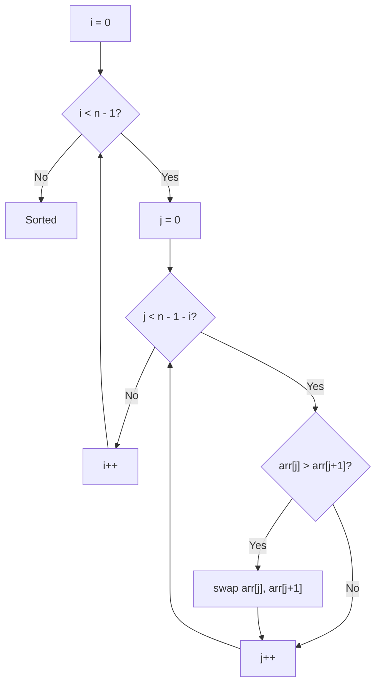
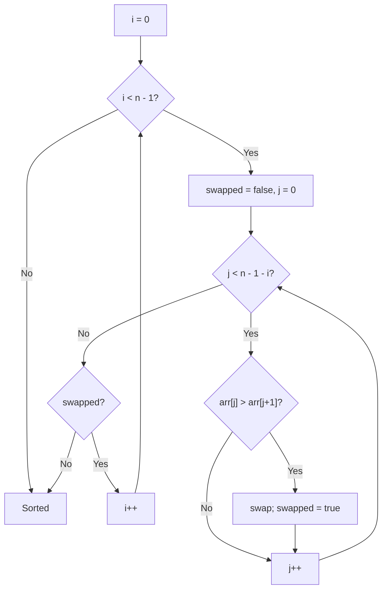
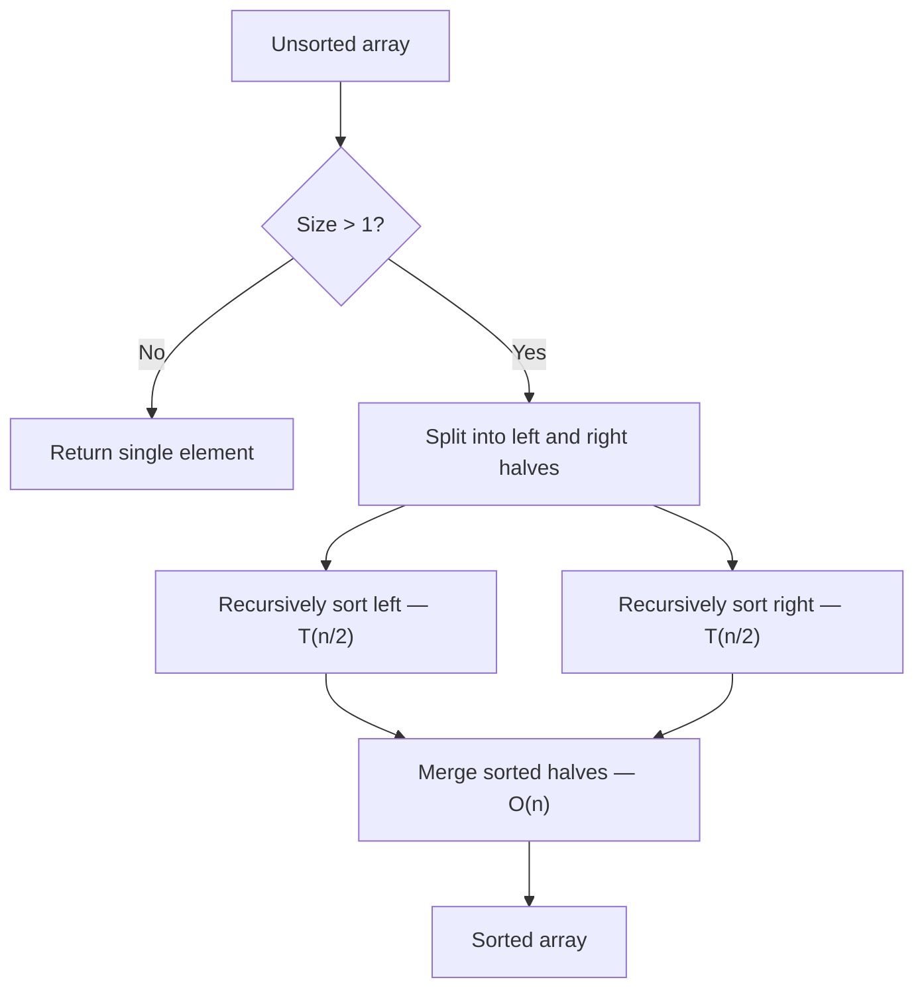

# Bubble Sort

## Problem Statement
Sort an array of integers in ascending order using the bubble sort algorithm. Repeatedly step through the list, compare adjacent elements, and swap them if they are in the wrong order.

## Pattern / Topic
Sorting

## Approaches

### 1. Brute Force — Naive Bubble Sort

**Idea:** Use two nested loops; the inner loop bubbles the largest unsorted element to its correct position on each pass.

**Step-by-step:**
1. Outer loop: `i` from `0` to `n - 2` (n - 1 passes).
2. Inner loop: `j` from `0` to `n - 2 - i`.
3. If `arr[j] > arr[j+1]`, swap them.
4. After pass `i`, the element at position `n - 1 - i` is in its final place.

**Why it works:** Each pass guarantees the next-largest unsorted element "bubbles up" to its sorted position at the end of the unsorted region. After `n - 1` passes, every element is in place.

**Time Complexity Breakdown:**
- Outer loop runs `n - 1` times.
- On pass `i`, the inner loop runs `n - 1 - i` comparisons.
- Total comparisons: `(n-1) + (n-2) + ... + 1 = n(n-1)/2`.
- Each comparison does O(1) work (compare + possible swap).
- Combined: **O(n^2)** in all cases (best, average, worst) — no early exit.

**Space Complexity Breakdown:**
- Only loop counters and one temp variable for swapping: O(1).
- Sorting is in-place.
- Total extra space: **O(1)**.

**Pros:** Extremely simple to implement; stable sort; in-place with no extra memory.
**Cons:** Always O(n^2) even on nearly-sorted input; many redundant comparisons.

---

### 2. Alternative — Optimized Bubble Sort (Early Termination)

**Idea:** Track whether any swap occurred during a pass. If a full pass completes with no swaps, the array is already sorted — exit early.

**Step-by-step:**
1. Outer loop: `i` from `0` to `n - 2`.
2. Set `swapped = false` at the start of each pass.
3. Inner loop: `j` from `0` to `n - 2 - i`.
4. If `arr[j] > arr[j+1]`, swap them and set `swapped = true`.
5. After the inner loop, if `swapped == false`, break out of the outer loop.

**Why it works:** If no swaps occur in a pass, every adjacent pair is in order, which means the entire array is sorted. This lets us skip remaining passes on nearly-sorted data.

**Time Complexity Breakdown:**
- **Worst case** (reverse-sorted): every pass performs swaps, no early exit. Same as naive: n(n-1)/2 comparisons = **O(n^2)**.
- **Average case**: still O(n^2) — most random permutations require many passes.
- **Best case** (already sorted): the first pass does n-1 comparisons, finds no swaps, and exits. Total: **O(n)**.
- The key insight: the flag adds O(1) overhead per pass but can save entire passes worth of O(n) work on nearly-sorted input.

**Space Complexity Breakdown:**
- Same as naive plus one boolean flag: O(1).
- Total extra space: **O(1)**.

**Pros:** Best-case O(n) on nearly-sorted data; minimal code change over brute force; still stable and in-place.
**Cons:** Still O(n^2) average and worst case; not competitive with O(n log n) sorts for large inputs.

---

### 3. Optimal — Merge Sort / Quick Sort (Context)

**Idea:** For general-purpose sorting, comparison-based algorithms like merge sort and quicksort achieve the theoretical lower bound of O(n log n). Bubble sort is presented here as a learning exercise, not as a production sorting choice.

**Step-by-step (Merge Sort):**
1. Recursively split the array into two halves until each sub-array has one element.
2. Merge pairs of sorted sub-arrays back together by comparing their front elements.

**Step-by-step (Quick Sort):**
1. Pick a pivot element.
2. Partition the array so elements less than the pivot come before it and greater elements come after.
3. Recursively sort the two partitions.

**Why it works:** Both algorithms exploit divide-and-conquer. Merge sort guarantees balanced splits (always halves), giving consistent O(n log n). Quicksort achieves O(n log n) on average via random or median-of-three pivoting, though worst-case (already sorted with naive pivot) is O(n^2).

**Time Complexity Breakdown:**
- **Merge Sort:** log_2(n) levels of recursion. At each level, merging all sub-arrays visits each element once: O(n). Total: O(n) * log_2(n) = **O(n log n)** in all cases.
- **Quick Sort:** average case partitions roughly in half → O(n log n). Worst case (bad pivots) → O(n^2), but randomization makes this extremely unlikely.

**Space Complexity Breakdown:**
- **Merge Sort:** needs a temporary array of size n for merging: **O(n)**. Recursion stack: O(log n).
- **Quick Sort:** in-place partitioning uses **O(log n)** stack space on average. Worst-case stack: O(n).

**Pros:** Asymptotically optimal comparison-based sorting; practical for large datasets.
**Cons:** More complex implementation; merge sort needs O(n) extra space; quicksort is not stable by default.

---

## Approach Comparison

| Approach | Time (worst) | Time (best) | Space | Pros | Cons |
|----------|-------------|-------------|-------|------|------|
| Naive Bubble Sort | O(n^2) | O(n^2) | O(1) | Simple, stable, in-place | Always quadratic |
| Optimized Bubble Sort | O(n^2) | O(n) | O(1) | Linear on nearly-sorted | Still quadratic worst case |
| Merge Sort | O(n log n) | O(n log n) | O(n) | Guaranteed n log n; stable | O(n) extra space |
| Quick Sort | O(n^2) | O(n log n) | O(log n) | Fast in practice; in-place | Unstable; worst-case quadratic |

## Key Pitfalls
- Inner loop should run to `n - 1 - i`, not `n - 1`, since the last `i` elements are already sorted.
- Forgetting the early termination flag means always running O(n^2).
- Bubble sort is stable (equal elements keep their relative order).

## Interview Talking Points
- Mention it's the simplest sorting algorithm, good for teaching but not for production.
- Compare with insertion sort (also O(n^2) but faster in practice on small/nearly-sorted data).
- Know that interviewers usually ask this as a warm-up before discussing O(n log n) sorts.
- Understand stability — bubble sort is stable, quicksort is not (by default).

## Solutions
- C++: `cpp/src/sorting/bubble-sort.cpp`
- Go: `go/problems/sorting/bubble-sort.go`
- Visualizer metadata: `content/problems/sorting/bubble-sort.json`
